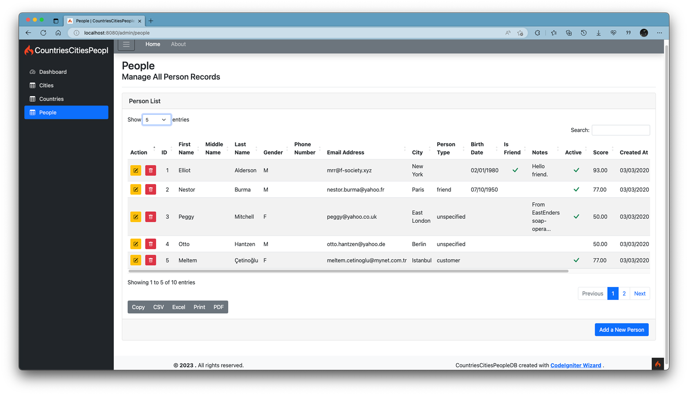

# Countries Cities People
**A Sample CodeIgniter 4 web application created with [CodeIgniter Wizard](https://www.ozar.net) using the responsive Bootstrap4-based AdminLTE v3 template**

## What is CodeIgniter?

CodeIgniter is a PHP full-stack web framework that is light, fast, flexible, and secure. 
More information can be found at the [official site](https://codeigniter.com).

## What is CodeIgniter Wizard?

CodeIgniter Wizard is a Rapid Application Development utility which helps quickly generate an advanced starting point for MySQL/MariaDB database-driven web applications with administrative interfaces.

With a database-first approach, the wizard asks you to select the tables and fields you want to include in your application, and then it automatically generates the necessary models, views and controllers - even the new CodeIgniter 4 entities, supporting standard database CRUD operations namely create, read, update and delete. It even creates a sidebar and (dashboard) home pages automatically with some basic data from your modules.
More information can be found at the [official site of CodeIgniter Wizard](https://www.ozar.net/products/codeigniterwizard/).

## Server Requirements for the Sample Application

PHP version 7.2 or higher is required, with the following extensions installed: 

- [intl](http://php.net/manual/en/intl.requirements.php)
- [libcurl](http://php.net/manual/en/curl.requirements.php) if you plan to use the HTTP\CURLRequest library

Additionally, make sure that the following extensions are enabled in your PHP:

- json (enabled by default - don't turn it off)
- [mbstring](http://php.net/manual/en/mbstring.installation.php)
- [mysqlnd](http://php.net/manual/en/mysqlnd.install.php)
- xml (enabled by default - don't turn it off)

## Video of the End-to-End Demo of Making of this App

## Screenshots

### Form View

### Grid View

### Database E-R Diagram

A [tutorial](https://www.arclerit.com/blog/new-data-modeling-capabilities-of-navicat-15-in-action/) for designing the relational data model in Navicat and then exporting (DDL of) it to a database can be found at [www.arclerit.com/blog/new-data-modeling-capabilities-of-navicat-15-in-action](https://www.arclerit.com/blog/new-data-modeling-capabilities-of-navicat-15-in-action/)