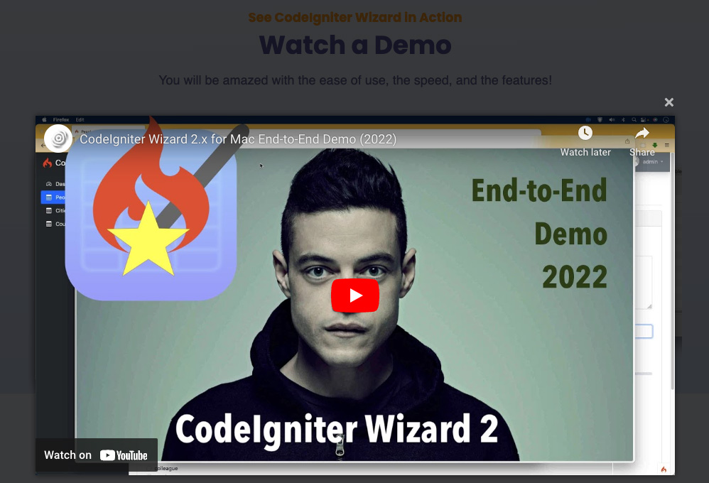

# Countries Cities People
**A Sample CodeIgniter 4 web application created with [CodeIgniter Wizard](https://www.ozar.net/products/?r=github) using the responsive Bootstrap4-based AdminLTE v3 template**

This is a database-driven sample CodeIgniter 4 project generated with the 'CodeIgniter Wizard' Mac application. The source code is what you get from the CRUD code generator and has not been manually edited outside the wizard application for an accurate demonstration of the capabilities of the code generator, as well as the quality of the re-usable code it generates. 

[See the Demo Web Application Online](https://www.ozar.net/products/codeigniterwizard/demowebapp/?r=github)

## What is CodeIgniter Wizard?

CodeIgniter Wizard is a Rapid Application Development utility which helps quickly generate an advanced starting point for MySQL/MariaDB database-driven web applications with administrative interfaces.

With a database-first approach, the wizard asks you to select the tables and fields you want to include in your application, and then it automatically generates the necessary models, views and controllers - even the new CodeIgniter 4 entities, supporting standard database CRUD operations namely create, read, update and delete. It even creates a sidebar and (dashboard) home pages automatically with some basic data from your modules.
More information can be found at the [official site of CodeIgniter Wizard](https://www.ozar.net/products/codeigniterwizard/?r=github).

## Screenshots

### Form View

### Grid View

[Visit the Live Demo Web Application Online](https://www.ozar.net/products/codeigniterwizard/demowebapp/?r=github)

### Underlying Database
An SQL dump of the database is present at the root of the project. The current version is ccpv4.sql.

## Video of the End-to-End Demo of Making of this App

[Watch on YouTube](https://www.youtube.com/watch?v=zInvLFw_yFc)

## Installing a local feature-rich PHP development environment for Mac Users (using Homebrew)

### Installing Homebrew on macOS Big Sur

[Watch on YouTube](https://www.youtube.com/watch?v=_n2YexLCN8c)

### Installing PHP 8 via Homebrew on macOS Big Sur

[Watch on YouTube](https://www.youtube.com/watch?v=UK7zPZlUkZg)

### Database E-R Diagram

A [tutorial](https://www.arclerit.com/blog/new-data-modeling-capabilities-of-navicat-15-in-action/) for designing the relational data model in Navicat and then exporting (DDL of) it to a database can be found at [www.arclerit.com/blog/new-data-modeling-capabilities-of-navicat-15-in-action](https://www.arclerit.com/blog/new-data-modeling-capabilities-of-navicat-15-in-action/?r=github%p=ozarnet)

## About the Open-source CodeIgniter Framework

CodeIgniter is a PHP full-stack web framework that is light, fast, flexible and secure.
More information can be found at the [official site](http://codeigniter.com).

CodeIgniter4 repository holds the distributable version of the framework,
including the user guide. It has been built from the
[development repository](https://github.com/codeigniter4/CodeIgniter4).

More information about the plans for version 4 can be found in [the announcement](http://forum.codeigniter.com/thread-62615.html) on the forums.

The user guide corresponding to this version of the framework can be found
[here](https://codeigniter4.github.io/userguide/).

## Important Change with index.php from CodeIgniter version 3

`index.php` is no longer in the root of the project! It has been moved inside the *public* folder,
for better security and separation of components.

This means that you should configure your web server to "point" to your project's *public* folder, and
not to the project root. A better practice would be to configure a virtual host to point there. A poor practice would be to point your web server to the project root and expect to enter *public/...*, as the rest of your logic and the
framework are exposed.

**Please** read the user guide for a better explanation of how CI4 works!

## Repository Management

We use Github issues, in our main repository, to track **BUGS** and to track approved **DEVELOPMENT** work packages.
We use our [forum](http://forum.codeigniter.com) to provide SUPPORT and to discuss
FEATURE REQUESTS.

This repository is a "distribution" one, built by our release preparation script.
Problems with it can be raised on our forum, or as issues in the main repository.

## Contributing

We welcome contributions from the community.

Please read the [*Contributing to CodeIgniter*](https://github.com/codeigniter4/CodeIgniter4/blob/develop/contributing.md) section in the development repository.

## Server Requirements

PHP version 7.3 or higher is required, with the following extensions installed:

- [intl](http://php.net/manual/en/intl.requirements.php)
- [libcurl](http://php.net/manual/en/curl.requirements.php) if you plan to use the HTTP\CURLRequest library

Additionally, make sure that the following extensions are enabled in your PHP:

- json (enabled by default - don't turn it off)
- [mbstring](http://php.net/manual/en/mbstring.installation.php)
- [mysqlnd](http://php.net/manual/en/mysqlnd.install.php)
- xml (enabled by default - don't turn it off)
